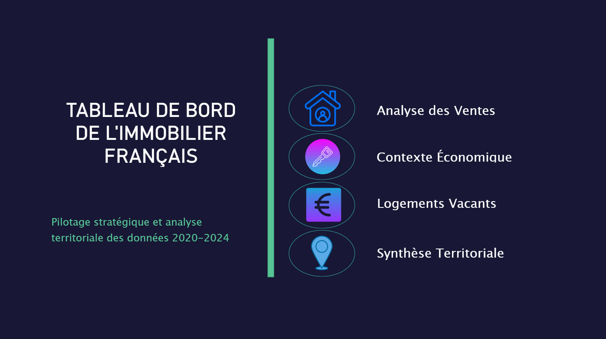
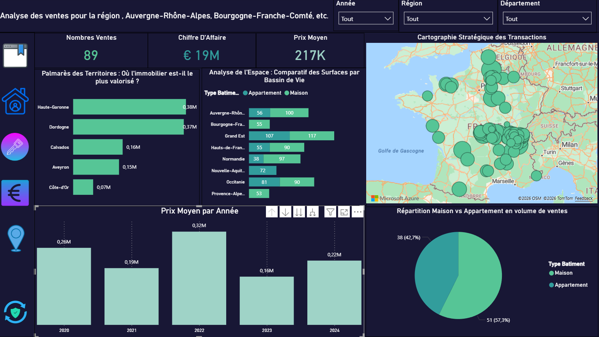
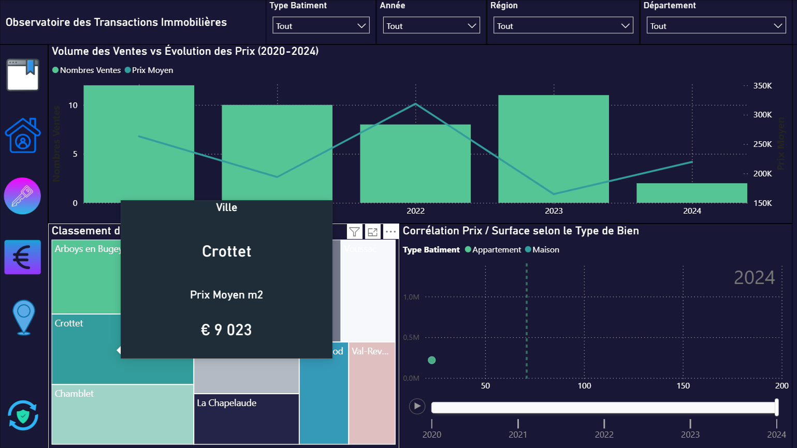
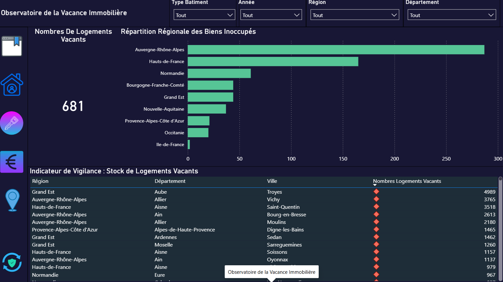
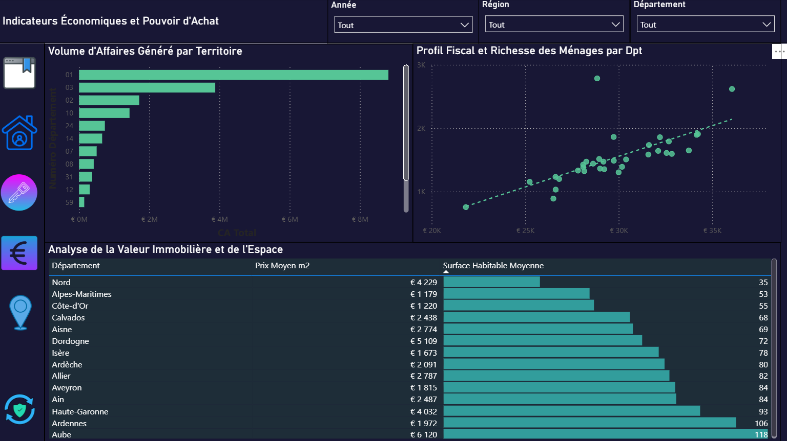
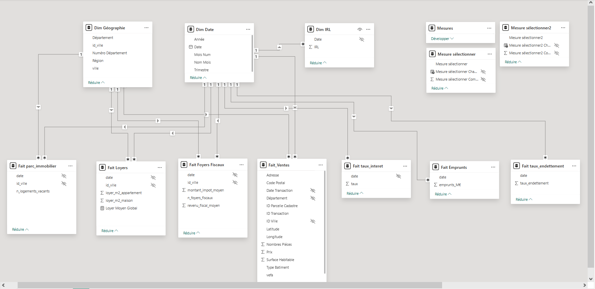

# 🏠 Observatoire de l'Immobilier Français (2020-2024) - Power BI

## 📝 Présentation du Projet
Cet observatoire est un outil d'aide à la décision stratégique conçu pour analyser le marché immobilier français sur une période de 5 ans. Il croise des données massives de transactions (DVF) avec des indicateurs fiscaux et des données sur la vacance immobilière pour offrir une vision à 360° du secteur.

L'objectif est de permettre aux investisseurs, professionnels de l'immobilier et décideurs publics d'identifier les zones de tension, de corréler les prix au pouvoir d'achat et d'optimiser leurs stratégies territoriales.

---

## 🛠️ Stack Technique
*   **Outil BI :** Power BI Desktop
*   **Langage de calcul :** DAX (Data Analysis Expressions) avancé
*   **Préparation des données :** Power Query (Langage M) avec optimisation du Query Folding
*   **Modélisation :** Schéma en étoile (Star Schema)
*   **Sources de données :** Transactions (DVF), Insee (Foyers fiscaux), Parc immobilier (Logements vacants)

---

# 🏠 Mon Projet Power BI Immobilier

## 🖼️ Aperçu du Rapport

| **Accueil** | **Analyse des Ventes** |
| :---: | :---: |
|  |  |

| **Transactions** | **Vacance Immobilière** |
| :---: | :---: |
|  |  |

| **Économie** | **Modèle de Données** |
| :---: | :---: |
|  |  |

---

## 📊 Analyse Détaillée des Pages

### 1. Page d'accueil (Sommaire interactif)
*   **Rôle :** Point d'entrée unique du rapport.
*   **Utilité :** Permet à l'utilisateur de s'orienter immédiatement vers la thématique souhaitée (Ventes, Économie, Vacance ou Synthèse) via une interface épurée.

### 2. Analyse des Ventes (Focus Transactions)
*   **Rôle :** Vision macro et micro du marché immobilier.
*   **Détails :** Suivi du volume des transactions, du CA global et du prix moyen. La cartographie permet d'identifier visuellement les zones de forte activité.

### 3. Observatoire des Transactions (Détails & Tendances)
*   **Rôle :** Analyse de la corrélation prix/volume sur la période 2020-2024.
*   **Innovation :** Utilisation de **Tooltips (infobulles)** personnalisés pour isoler le prix au m² par ville sans quitter la vue d'ensemble.

### 4. Observatoire de la Vacance Immobilière
*   **Rôle :** Identification des zones de tension et du stock de logements inoccupés.
*   **Fonctionnalité :** Tableau de vigilance avec indicateurs colorés (KPIs visuels) pour repérer les villes où la vacance est critique.

### 5. Indicateurs Économiques & Pouvoir d'Achat
*   **Rôle :** Mise en perspective de l'immobilier avec la richesse des ménages.
*   **Analyse :** Croisement du prix au m² avec le revenu fiscal moyen par département via un nuage de points pour détecter les anomalies de marché.

---

## ⚡ Fonctionnalités Avancées & UX
*   **Titres Dynamiques :** Adaptation automatique du titre selon les filtres de région ou de département sélectionnés.
*   **Interactivité "Color Switch" :** Le thème couleur des graphiques s'ajuste dynamiquement selon la métrique choisie (Ventes, CA ou Prix Moyen) pour guider l'œil.
*   **Performance DAX :** Mesures optimisées pour gérer des volumes de données importants (+1,3M de lignes) avec fluidité.

---

## 👤 Contact
Sébastien Henique- Data Analyst Freelance
*   LinkedIn : www.linkedin.com/in/sebastien-henique-data-analyst
*   E-mail : Heniquea38@gmail.com
