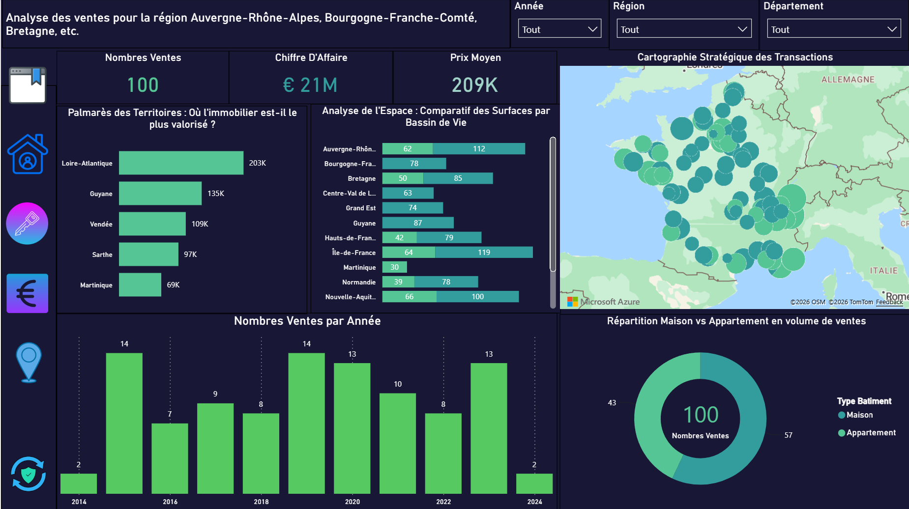
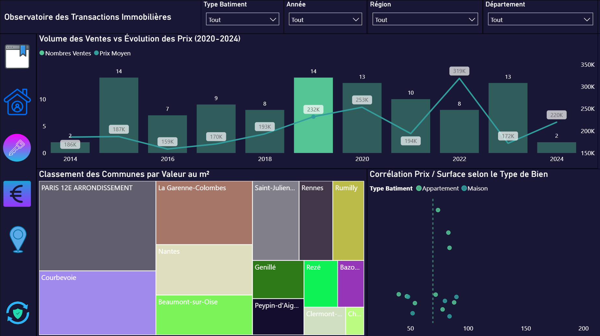
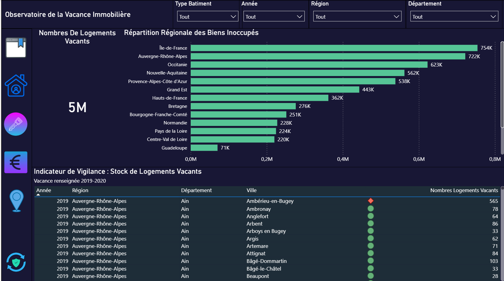
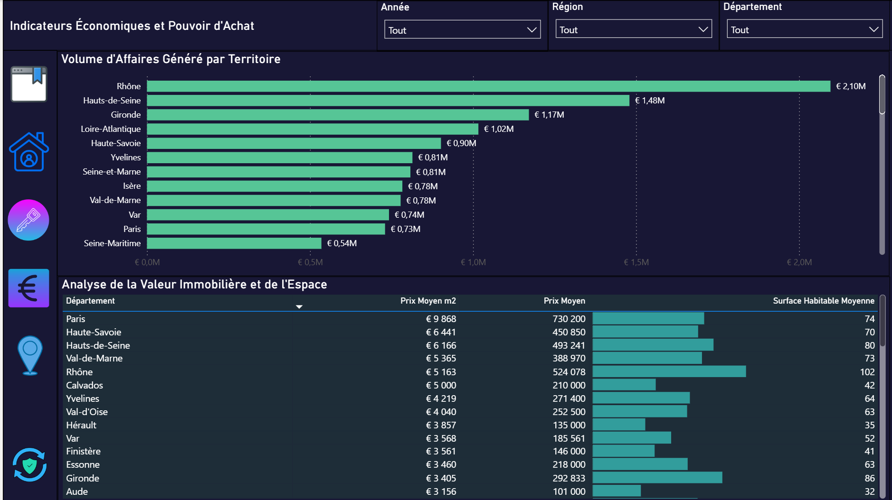
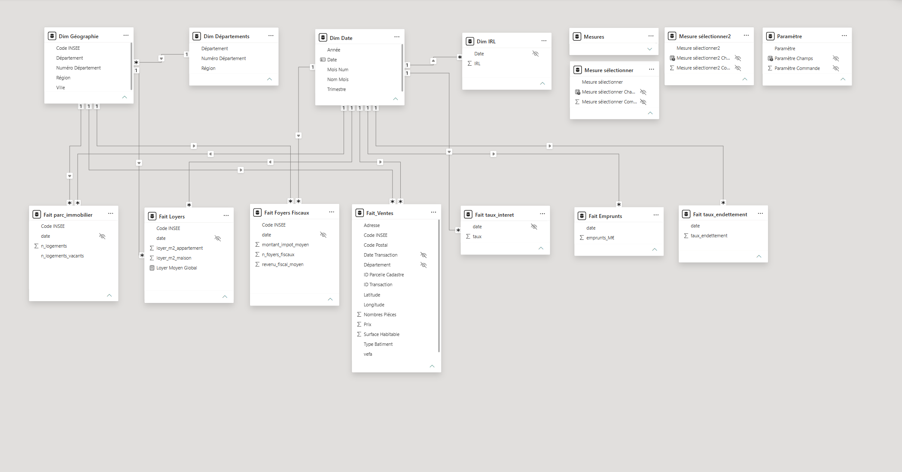

# Tableau de bord de l'immobilier français

Rapport Power BI sur le marché immobilier français à la maille communale : transactions,
loyers, parc de logements, revenus fiscaux et conjoncture de financement.

Le projet est versionné au **format PBIP** — modèle sémantique en TMDL, rapport en JSON —
donc lisible et comparable d'un commit à l'autre.

---

## Aperçu

### Accueil


### Analyse des ventes
Volumes, prix moyens et cartographie des transactions, avec palmarès des territoires et
répartition maison / appartement.



### Observatoire des transactions immobilières
Croisement volume / prix par année, classement des communes à la valeur au m², et corrélation
prix-surface par type de bien.



### Observatoire de la vacance immobilière
Répartition régionale des logements inoccupés et table de vigilance à la commune.



### Indicateurs économiques et pouvoir d'achat
Volume d'affaires par territoire, profil fiscal des ménages par département, et analyse de la
valeur immobilière rapportée à la surface.



---

## Le modèle

Schéma en étoile : 15 tables, 13 relations, toutes en « plusieurs vers un » et
unidirectionnelles. Deux dimensions conformes, `Dim Date` et `Dim Géographie`, partagées par
l'ensemble des tables de faits.



La clé géographique est le **code INSEE sur 5 caractères**, reconstruit comme
`département + code commune`. Les fichiers source numérotent les communes *à l'intérieur* de
chaque département : `id_ville` seul n'est pas un identifiant national.

`Dim Départements` est rattachée à `Dim Géographie` et porte le nom du département et sa
région. Elle est écrite en dur dans la requête, sans dépendance à un fichier externe.

Les quatre séries de conjoncture — taux d'intérêt, emprunts, taux d'endettement, IRL — sont
**nationales** et n'ont volontairement aucune relation avec `Dim Géographie`.

---

## Les données

| Table | Lignes | Période | Grain |
|---|---:|---|---|
| `Fait_Ventes` | 100 | 2014 → 2024 | transaction |
| `Fait Foyers Fiscaux` | 315 542 | 2014 → 2022 | commune × année |
| `Fait Loyers` | 105 391 | 2018, 2022, 2023 | commune × année |
| `Fait parc_immobilier` | 48 627 | 2019 → 2021 | commune × année |
| `Fait Emprunts` | 170 | 2010 → 2024 | mois |
| `Fait taux_interet` | 116 | 2014 → 2024 | mois |
| `Dim IRL` | 87 | 2002 → 2024 | trimestre |
| `Fait taux_endettement` | 11 | 2012 → 2022 | année |
| `Dim Géographie` | 36 776 | — | commune |
| `Dim Départements` | 101 | — | département |
| `Dim Date` | 9 131 | 2002 → 2026 | jour |

Les fichiers source ne sont pas versionnés : 26 Mo en CSV, et le jeu complet des transactions
(`transactions.npz`, 337 Mo) dépasse la limite de 100 Mo par fichier de GitHub.

---

## Corrections de modélisation

Le modèle initial produisait des résultats faux sans lever la moindre erreur. Les correctifs,
par ordre de gravité :

**Clé géographique inexistante.** `id_ville` est le code commune interne au département : la
commune n°2 est Cayenne en Guyane *et* Aguessac dans l'Aveyron. La jointure sur ce seul numéro
rattachait les ventes de Lille à un village de l'Ain. Remplacée par un code INSEE composite.
La dimension passe de 908 à 36 776 communes.

**Déduplication destructrice.** Un `Table.Distinct` par `id_ville` sur quatre tables de faits
détruisait la granularité : les foyers fiscaux tombaient de 315 542 à 949 lignes, les loyers
de 105 391 à 908.

**Dates stockées en année entière.** Converties par `type date`, les valeurs `2018` étaient
lues comme des numéros de série et donnaient le **10/07/1905**. Aucune ligne de loyers ne
trouvait sa date. Remplacé par `#date(année, 1, 1)`.

**Table de dates trop étroite.** `Dim Date` couvrait 2020 → aujourd'hui alors que les faits
remontent à 2002 : plus de la moitié des ventes tombaient hors calendrier, silencieusement.

**Référentiel externe manquant.** Le fichier de correspondance département → région n'existait
plus sur le disque et bloquait toute actualisation. Remplacé par la table `Dim Départements`.

**Relation bidirectionnelle sur une dimension partagée.** Auto-détectée entre le parc
immobilier et `Dim Géographie`, elle propageait les filtres du parc vers les trois autres
tables de faits. Repassée en unidirectionnelle.

**Colonne supprimée à tort.** `n_logements` était retirée par la requête, ce qui rendait tout
taux de vacance impossible à calculer.

Après correction : **zéro ligne orpheline** sur les treize relations.

---

## Ouvrir le projet

Ouvrez `Immobilier_France.pbip` avec Power BI Desktop (format PBIP activé).

Les requêtes Power Query pointent vers un dossier local. Pour actualiser, adaptez le chemin en
tête de chaque requête :

```
C:\Users\<vous>\...\archive (5)\
```

Fichiers attendus : `transactions_sample.csv`, `loyers.csv`, `foyers_fiscaux.csv`,
`parc_immobilier.csv`, `taux_interet.csv`, `taux_endettement.csv`,
`flux_nouveaux_emprunts.csv`, `indice_reference_loyers.csv`.

---

## Limites connues

**Les ventes sont un échantillon.** `transactions_sample.csv` contient 100 transactions. Le jeu
complet en compte 9 141 573 (2014 → juin 2024), au format `.npz` illisible par Power Query.
Les statistiques de prix sont donc indicatives, pas représentatives : certains départements
n'ont qu'une ou deux ventes, d'où des prix au m² aberrants sur la vue départementale.

**Le parc de logements est incomplet, et de façon complémentaire.** Dans le fichier source,
`n_logements` est vide sur toute l'année 2019, et `n_logements_vacants` sur toute l'année 2021.
Seule **2020** porte les deux colonnes : c'est la seule année sur laquelle le taux de vacance
est calculable. Les chiffres de vacance se lisent année par année — le stock de logements
vacants ne s'additionne pas entre millésimes.

**Faits annuels rattachés au 1er janvier.** Foyers fiscaux, loyers et parc sont annuels et
joints à `Dim Date` au premier jour de l'année. Filtrez par année : un filtre sur un mois
autre que janvier renverra du vide sur ces trois tables.

**Moyennes non pondérées.** Les revenus et impôts moyens agrègent des moyennes communales sans
pondération par le nombre de foyers. Une commune de 50 foyers y pèse autant que Paris —
l'écart atteint 29 % sur l'impôt moyen parisien.
